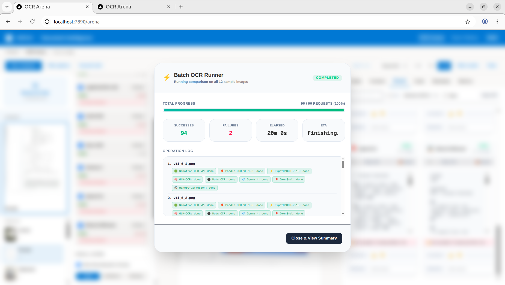
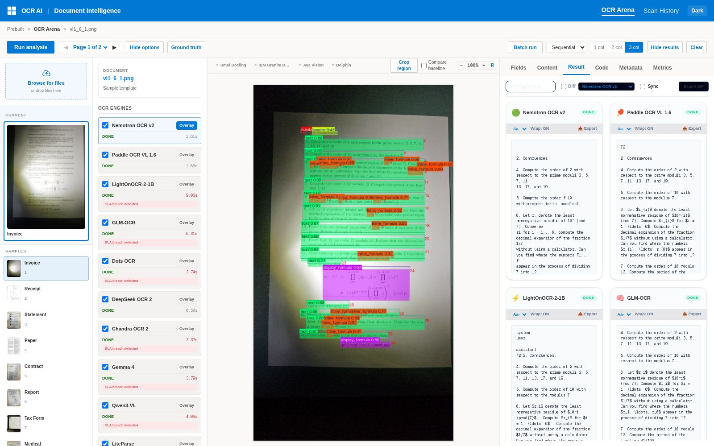

# OCR Arena

A modern Next.js web application providing a high-performance **OCR Arena** user interface for processing documents, comparing multi-engine OCR outputs, analyzing layout visualizations, and checking historical telemetry.





---

## 1. Key Features

### Compare Workspace
* **Side-by-Side Comparison**: Evaluate text parsing, raw JSONs, markdown structure, and metadata trees across six OCR engines simultaneously.
* **Interactive Canvas**: Drag, zoom, and pan original document previews. Double-click bounding boxes to inspect parsed text content and OCR confidence.
* **Unified Multi-Engine Overlays**: Display colored bounding boxes from multiple engines simultaneously on the document canvas, utilizing distinct color palettes per engine.
* **Interactive Region Cropper**: Drag a region on the canvas to crop it, and trigger OCR re-analysis on that region specifically.
* **Confidence & Entity Filtering**: Use sliders to filter bounding boxes by confidence threshold, or toggle entity type visibility (headers, text, tables, formulas, etc.).
* **Typography & Sync Controls**: Globally customize font sizes and word wrap settings. Sync scrollbars across all model cards.
* **Engine Performance Matrix**: Compare OCR processing metrics (latency, character count, estimated cost, and average confidence) for active runs.

### Scan History
* **Activity Calendar Heatmap**: View daily scan volumes via a GitHub-style calendar heatmap, with single-click date filtering.
* **Timeline Grouping**: Group historical runs under expandable chronological headers (e.g. *Today*, *Yesterday*, *Last 7 Days*).
* **Sidebar Metadata Filters**: Instantly slice log lists using clickable widgets for top vendors, file categories, currencies, and custom tags.
* **Bulk Tagging & Updates**: Select multiple entries to perform batch metadata edits or apply tags in bulk.
* **HTML Comparison Export**: Generate self-contained, offline-viewable styled HTML comparison reports for selected runs.

### Telemetry & Analytics
* **Pareto Scatter Plot (Cost vs. Latency)**: Plot average latency against page cost with an auto-drawn Pareto frontier showing optimal efficiency trade-offs.
* **SLA Configuration**: Set targets for latency and accuracy, rendering dotted threshold lines on charts and displaying green/red SLA status badges.
* **Radar Chart**: Evaluate Speed, Accuracy (CER/WER), Cost, Success Rate, and Document Variety in a multi-dimensional spider web view.
* **System Breakdown Charts**: Map p50/p90/p99 latency distributions, runs-per-hour volume throughput, and success rate heatmaps by document size brackets.

---

## 2. Architecture & Setup

This repository consists of:
* **`src/`**: Next.js App Router frontend, Tailwind CSS styling, custom react hooks, and database schemas.
* **[ocr-engines](ocr-engines)**: Submodule containerizing docker configurations, vLLM servers (ports `8118`-`8121`), and Python backend layout-parsing APIs (ports `8090`-`8093`).
* **[andrej-karpathy-skills](andrej-karpathy-skills)**: Submodule with behavioral guidelines and Cursor rules for AI pair programming.

### Prerequisites
* **Node.js**: v20+
* **npm**: v10+
* **PostgreSQL**: Accessible database instance (run via Docker).
* **Docker & Docker Compose**: For containerized deployments.

### Local Installation
1. Install project dependencies:
   ```bash
   npm install
   ```
2. Setup environment variables:
   ```bash
   cp .env.example .env
   ```
   *Configure the database credentials and layout parser URLs in `.env` if custom endpoints are used.*

3. Setup Python testing environment using `uv`:
   * Create the virtual environment using `uv venv`:
     ```bash
     uv venv
     ```
   * Activate the virtual environment:
     ```bash
     source .venv/bin/activate
     ```
   * Install the project dependencies and Playwright browser binaries:
     ```bash
     uv sync
     uv run playwright install
     ```

### Running E2E Tests
To execute the Playwright test suite, you can run it inside the synced environment:
```bash
uv run python3 -m tests.run_all
```
Alternatively, if you have activated the virtual environment (`source .venv/bin/activate`), you can run python directly:
```bash
python3 -m tests.run_all
```

### Running via Docker Compose
To boot the database, Next.js frontend, reverse proxy, pipelines, and local OCR models:
```bash
docker compose up --build -d
```
Open [http://localhost:7890](http://localhost:7890) in your browser to access the reverse proxied app.

---

## 3. Developer & Agent Guidelines

If you are an AI developer agent (e.g., Claude Code, Gemini, Cursor) working on this codebase, you **must** read and adhere to:
* **[AGENTS.md](AGENTS.md)**: Workspace rules, E2E testing rules, and file length modularity restrictions (every file must target under 256 lines of code).
* **[andrej-karpathy-skills/CLAUDE.md](andrej-karpathy-skills/CLAUDE.md)**: Core guidelines regarding simplicity, surgical modifications, and goal-driven execution.

---

## 4. License

This project is licensed under the MIT License - see the [LICENSE](LICENSE) file for details.